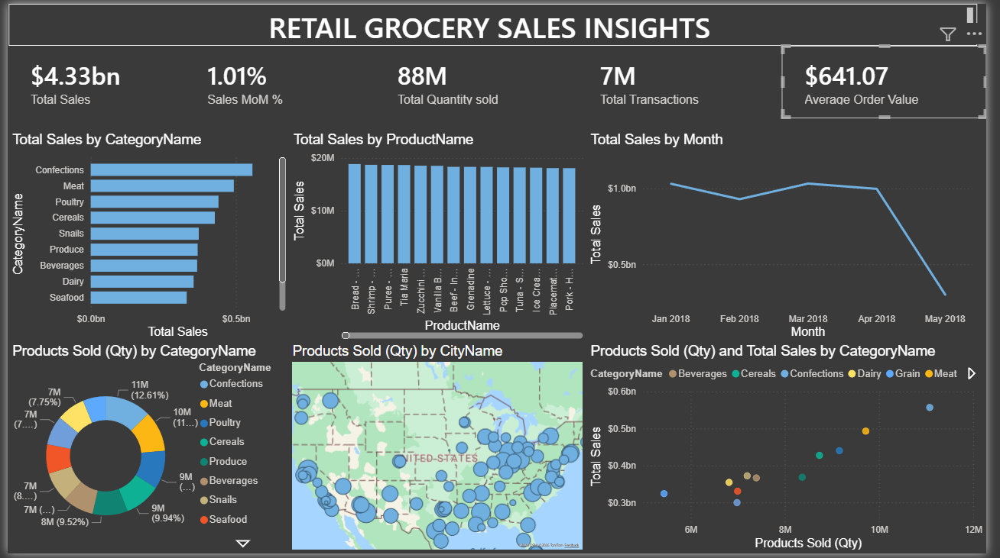

# 🛒 Retail Grocery Sales Dashboard (Power BI)

## 📌 Project Objective
To analyze retail grocery sales performance by examining total sales, quantity sold, transactions, product categories, geographic distribution, and time-based trends to support business decision-making.

---

## ❓ Business Questions
- What is the total sales revenue and quantity sold?
- Which product categories generate the highest sales?
- Which products contribute most to revenue?
- How do sales trend month over month?
- Which cities have the highest product sales?
- What is the relationship between quantity sold and total sales?
- What is the average order value?

---

## 🔄 Process & Methodology
- Imported grocery sales dataset into Power BI
- Built a Date Table and applied star schema modeling
- Cleaned and standardized data fields
- Created DAX measures:
  - Total Sales
  - Total Quantity Sold
  - Total Transactions
  - Average Order Value
  - Sales MoM %
- Designed an interactive dashboard with slicers

---

## 📊 Dashboard Visualizations
- KPI Cards (Sales, Quantity, Transactions, AOV, MoM %)
- Bar Chart – Sales by Category
- Column Chart – Sales by Product
- Line Chart – Monthly Sales Trend
- Donut Chart – Products Sold by Category
- Map – Products Sold by City
- Scatter Plot – Quantity vs Sales by Category

---

## 🖼️ Dashboard Preview

---

## 🔍 Key Insights
- $4.33B total sales with 88M units sold across 7M transactions
- Confections, Meat, and Poultry lead category sales
- Sales peak from January to April
- Strong correlation between quantity sold and total revenue
- Average Order Value is $641.07

---

## 🧠 Key Learnings
- Measures are preferred over calculated columns for KPIs
- Date tables are essential for time intelligence
- Clean visual hierarchy improves executive readability
- Geographic visuals reveal regional demand patterns

---

## 🛠️ Tools & Technologies
- Power BI
- DAX
- Excel / CSV
- Star Schema Data Modeling

---

## ✅ Final Conclusion
This dashboard provides a comprehensive view of grocery sales performance, enabling stakeholders to monitor trends, identify top categories, and make informed business decisions.

---

## 💼 Interview-Ready Highlights
- Built an end-to-end Power BI dashboard
- Implemented star schema and time intelligence
- Created business KPIs using DAX
- Designed interactive and executive-friendly visuals
